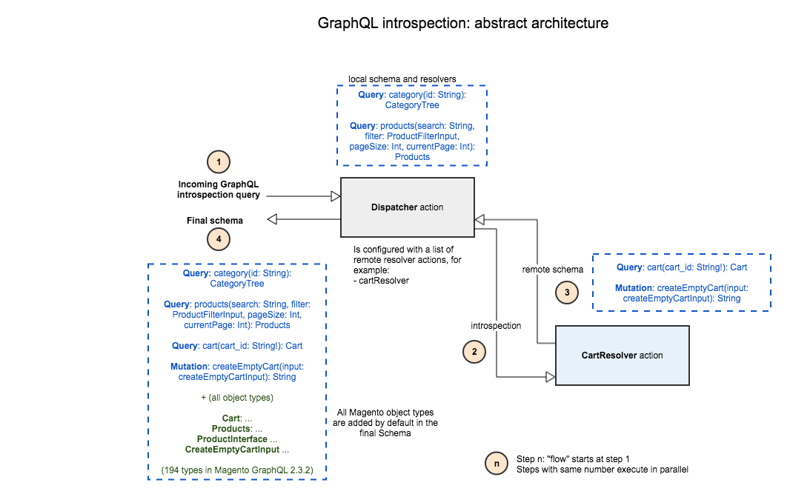
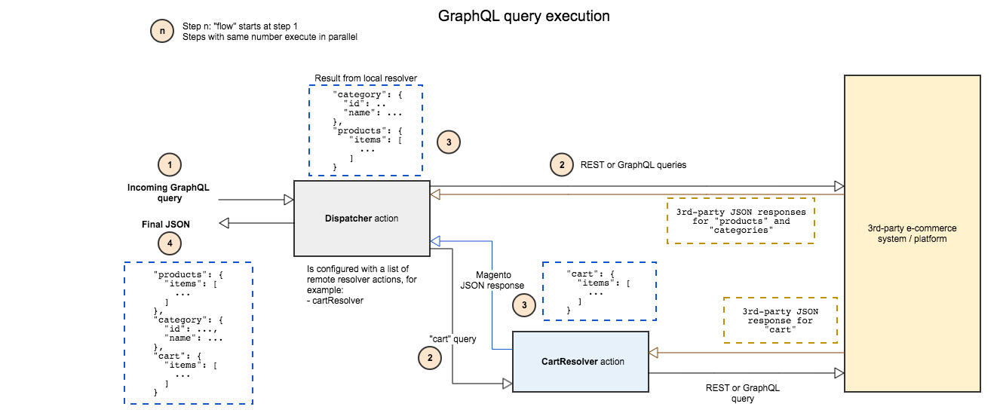

# 3rd-Party GraphQL integration with AEM Commerce and CIF on Adobe I/O Runtime by [diconium](https://www.diconium.com)

[](https://diconium.com/en/news/adobe-io-hybris)

## Introduction

The [CIF (Commerce Integration Framework) GraphQL connector](https://github.com/adobe/commerce-cif-connector) and the [AEM CIF Core Components](https://github.com/adobe/aem-core-cif-components) offer authoring and frontend integration between AEM (Adobe Experience Manager) and Magento. This integration is based on the [Magento GraphQL API](https://devdocs.magento.com/guides/v2.3/graphql/index.html) which offers a very flexible and efficient integration point between AEM and Magento.

In order to support other 3rd-party "non-Magento" commerce platforms, this project demonstrates how a 3rd-party commerce platform like Hybris can be integrated with the CIF GraphQL connector and the AEM CIF Core Components via the Magento GraphQL API. Note that the integration is currently based on the GraphQL API of Magento 2.4.2.

This enables customers to reuse our existing connector and components in their project by simply exposing the Magento GraphQL API on top of a 3rd-party commerce platform like Hybris. To offer maximum flexibility and scalability, this "adaptation layer" is deployed on the serverless [Adobe I/O Runtime](https://www.adobe.io/apis/experienceplatform/runtime.html) platform.

## Getting Started

### Project structure

This project is organized around [GraphQL resolvers](https://graphql.org/learn/execution/#root-fields-resolvers). Each resolver is either "local" or "remote". A "local" resolver is deployed and executed in the main Adobe I/O action that processes incoming GraphQL requests: we call this action the `dispatcher`. In contrast, a "remote" resolver is deployed as a separate Adobe I/O Runtime action which is referenced in the dispatcher action configuration and integrated via [schema delegation](https://www.apollographql.com/docs/graphql-tools/schema-delegation/).

All code is organized in the `cif` folder. In this implementation, all the resolvers are remote resolvers.

```
cif
├── common
   ├── dispatcher
├── cart
   ├── src
   ├── test
├── customer
├── order
├── product
├── category
├── resources
├── utils
```

The `common` folder contains all the code that fetches and converts 3rd-party data into the GraphQL format. These classes can be used either by the local dispatcher action or by remote resolvers.

### Local vs. remote resolvers

The main benefit of having local resolvers is that they all belong to the same `nodejs` process and hence can share data caches in order to optimise the fetching of data. In contrast, a remote resolver executes in a separate action in Adobe I/O Runtime, which means that it cannot share any data cache with the local resolvers. Each remote resolver is integrated with the dispatcher action and the local resolvers via [schema delegation](https://www.apollographql.com/docs/graphql-tools/schema-delegation/) where it implements a sub-part of the entire schema and acts like a remote GraphQL schema. The main benefit of remote resolvers/schemas is that they offer a flexible extensibility pattern to either customize the default Magento GraphQL schema or extend it with extra features. It is also possible to override a local resolver with a remote resolver, for example to customize a resolver on a project basis. 

Note that the loader and data classes in this project are developed in a way so that they can be used in local or remote resolvers. We strongly advise that a real implementation follows the same development pattern.

## Architecture

The following diagram illustrates the architecture of this reference implementation. It shows how introspection is performed in order to build the final entire schema. Some part of the final schema is "provided" by the `cartResolver` action.



This second diagram illustrates how a GraphQL query is being executed. The `cart` part of the query is delegated to the `cartResolver`. All the JSON responses are merged by the `dispatcher` action in order to build the full response.



## How to configure, build, test, and deploy

### Tools

Make sure you have the following tools installed:
* Node 10.x
* NPM 6.x
* [OpenWhisk CLI](https://github.com/apache/incubator-openwhisk-cli/releases)

OpenWhisk CLI must be available in your systems PATH and set up correctly to either use a local OpenWhisk installation or an Adobe I/O account. Try `wsk --help` to make sure it is working.

### Configuration
To be able to use this CIF connector you will need to provid some Hybris configurations to connect to your Hybris endpoint.
Under [cif/common/options.yml.example](cif/common/options.yml.example) you will find an example yml file you should use as an example.

The example file should look something like this
```
{
  "HB_CLIENTSECRET": "<CLIENT_SECRET>",
  "HB_CLIENTID": "<CLIENT_ID>",
  "HB_OAUTH_PATH": "/authorizationserver/oauth/token",
  "HB_API_HOST": "hybris.example.com",
  "HB_API_BASE_PATH": "/occ/v2/",
  "HB_BASESITEID": "electronics",
  "HB_PROTOCOL": "https",
  "HB_SECURE_BASE_MEDIA_URL": "https://hybris.example.com/yacceleratorstorefront"
}
```

You should copy the example file to an options.yml file under the same path, this will be the real file that will have your configurations.
This file is under .gitignore and should not be commited to the repository since it has client secrets.


### Build & Deployment

To install all the npm dependencies, and then execute all the unit tests, simply run:
```
$ npm install
$ npm test
```

To deploy the actions on the Adobe I/O Runtime platform, we use the [serverless](https://serverless.com/framework/docs/providers/openwhisk/) framework. The deployment of packages and actions is defined in the `serverless.yml` file. To deploy everything, simply run:
```
$ npm run deploy
```

This will deploy the `graphql-reference/dispatcher` and all other actions like cart, oder etc in your namespace (Complete list in serverless.yml file). The dispatcher is a web action that is accessible with the URL `https://adobeioruntime.net/api/v1/web/NAMESPACE/graphql-reference/dispatcher`. To test the GraphQL endpoint, you can for example use the `GraphiQL` plugin in the Chrome browser.

### Contributing

Contributions are welcomed! Read the [Contributing Guide](.github/CONTRIBUTING.md) for more information.

### Licensing

This project is licensed under the Apache V2 License. See [LICENSE](LICENSE) for more information.
